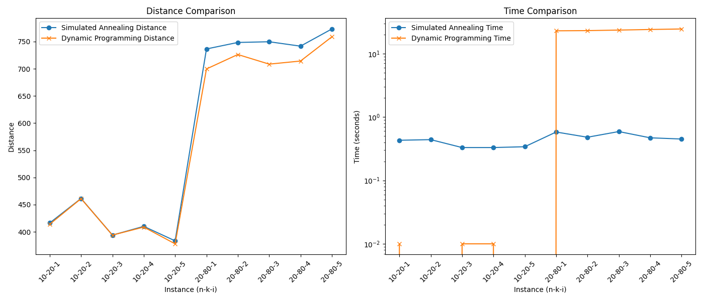

# CS271_TSP
## Dependencies:
- Python 3
- pip3 install numpy, argparse, random, math, time, matplotlib
## Generate New TSP Problems:
In console， `cd User/Path/CS271_TSP/SA`  
run `python3 generate_TSP.py -n N -k K -u U -v V -p P`
### Params:
- N  --  number of locations
- K  --  number of distinct distance values to use
- U  --  mean of normal distribution for distances
- V  --  variance (standard deviation) of normal distribution for distances
- p  --  number of problem instances to generate   

i.e.   run `python3 generate_TSP.py -n 10 -k 20 -u 50 -v 10 -p 5`    
if you want to use other input files with different parameters, just modify the `filenames` list in the main function of `SA_tsp.py` and `dp_tsp.py`
## Run Simulated Annealing Method
`cd User/Path/CS271_TSP/SA`   
run `python3 SA_tsp.py`
## Run Dynamic Programming Method
`cd User/Path/CS271_TSP/SA`   
run `python3 dp_tsp.py`
## Comparison of SA and DP
`cd User/Path/CS271_TSP/SA`   
run `python3 perf_SA_DP.py` 

it will show a figure of these 2 method's performances based on the input parameters `N = 10, K = 20, U = 50, V = 10` and `N = 20, K = 80, U = 50, V = 10`. 

If you get different results from different parameters, just modify the `# input params` and `# results of SA and DP` parts in `perf_SA_DP.py`.

